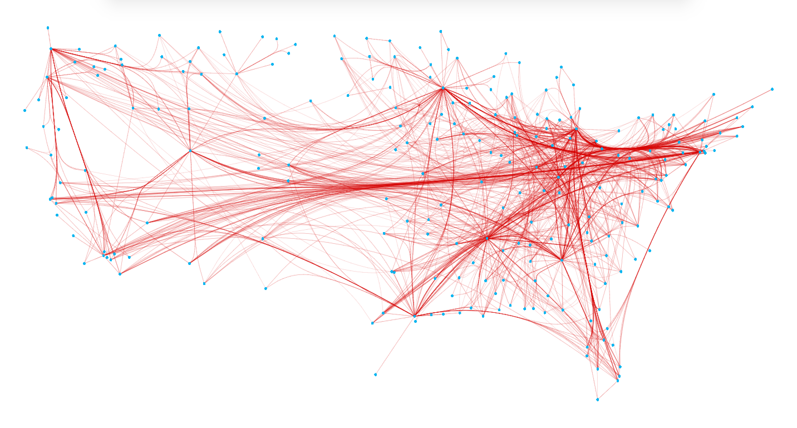

# fdeb
Force-directed edge bundling for undirected networks.

This program implements the force-directed edge bundling algorithm of Holten and van Wijk in C++ [1].


## requirements
OpenGL, which is already available on most systems and a recent g++ compiler.


## build
Just run make.


## usage
If no arguments are passed, the program prints the help menu that contains all available options.


## input files
Two input files are required: a CSV file (with spaces as delimiters) containing three columns (node label, x coordinate, y coordinate) and a space-delimitered CSV file containing the edge source and target labels.


## output file
Network in JSON format. Nodes have three keys (label, x, y), edges have only the coordinates of the subdivision points.


## test
The test directory contains a test file of the US airline network. Running

```
./fdeb --nodes test/network_nodes.csv --edges test/network_edges.csv --transparency 0.2 --I 100 --cycles 6 --visualize
```
should produce this visualization output:




## demo
The graphs in [2] were generated using `fdeb` ([open version](https://arxiv.org/pdf/1603.00910.pdf)).


## bibliography
[1] Danny Holten and Jarke van Wijk: Force-Directed Edge Bundling for Graph
	   Visualization. *Computer Graphics Forum* (Blackwell Publishing Ltd) 28, no. 3 (2009): 983-990.  
[2] Enys Mones, Arkadiusz Stopczynski, Alex ‘Sandy’ Pentland, Nathaniel Hupert, Sune Lehmann: Optimizing targeted vaccination across cyber–physical networks: an empirically based mathematical simulation study. *Journal of The Royal Society Interface* 15 (138) (2018)